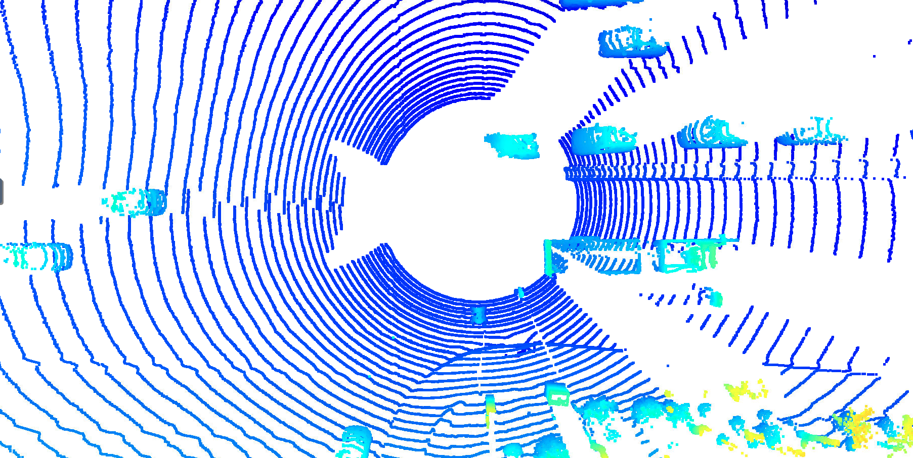
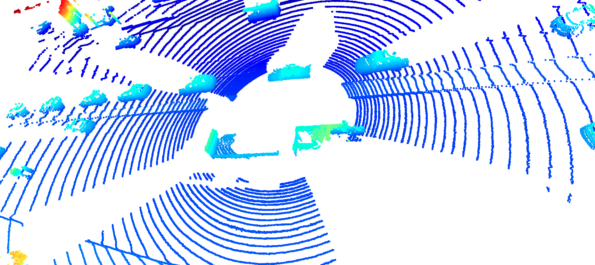
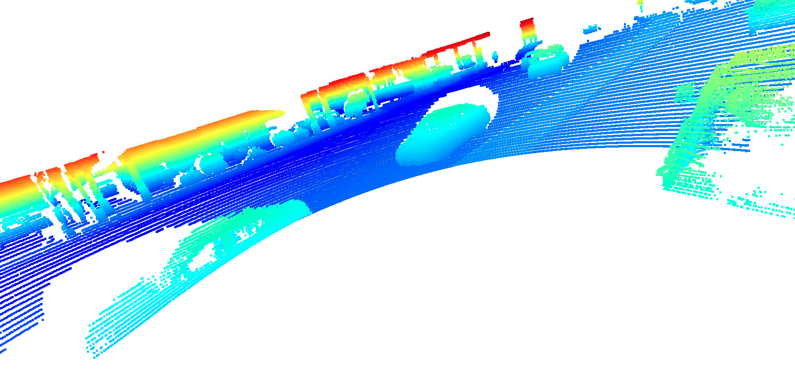
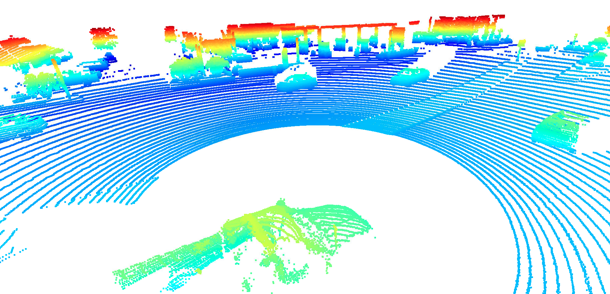
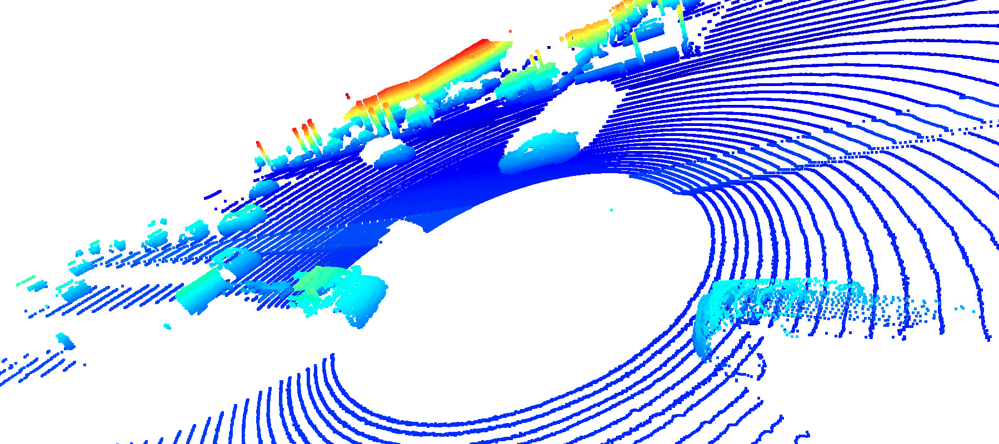
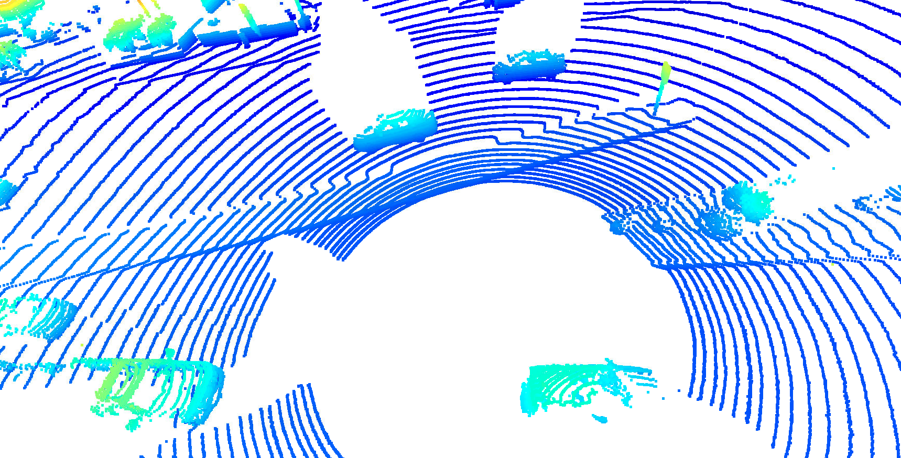
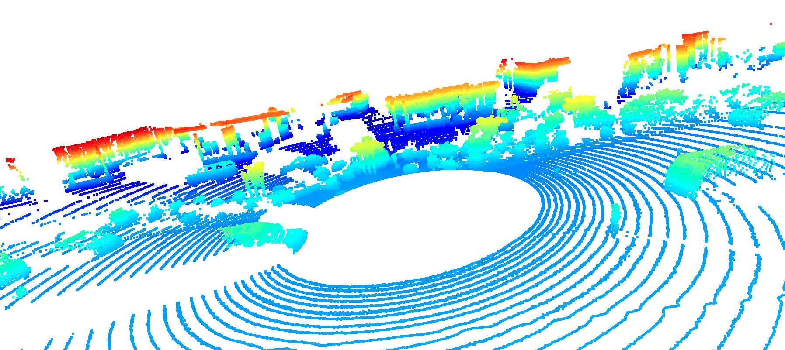
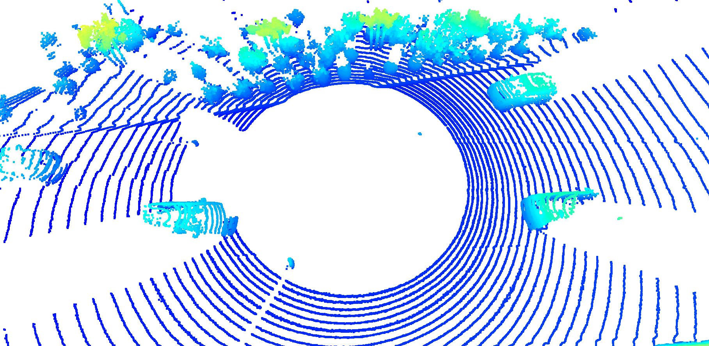
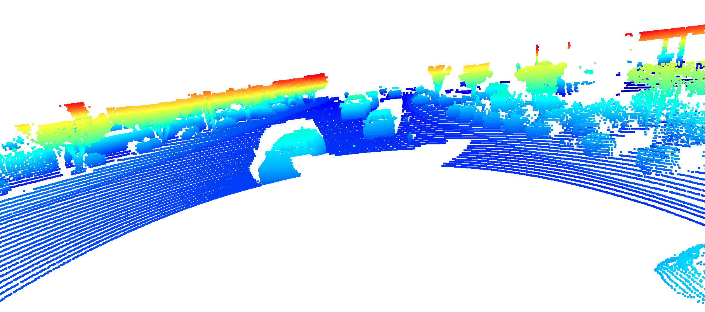
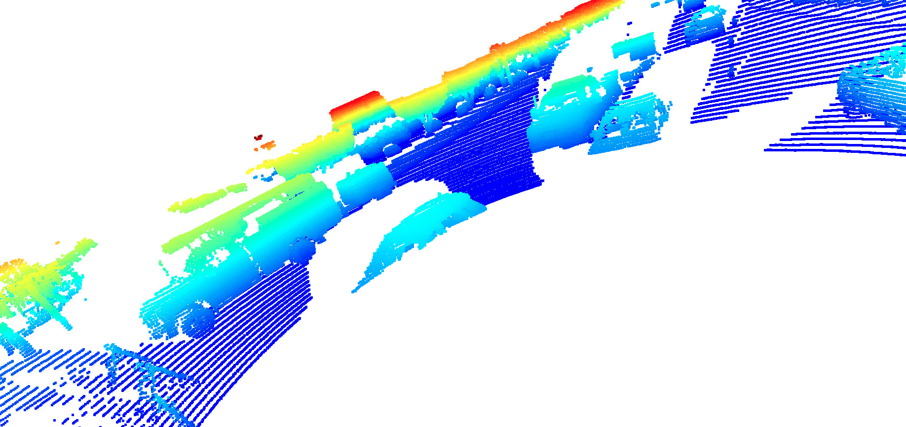

# Lidar point cloud visualization
We present 10 examples of vehicles with varying degrees of visibility in the point-cloud  

In this image, we can see multiple vehicles easily detectable. The portion facing the lidar sensor is the most visible part of these vehicles. But, we can notice that if a vehicle is far away from the sensor, it becomes less visible (low intensity).

 

Again, we have more than one car visible in this image. In this example, we can even detect the wheels of some of them.

 

In this example, we change a bit the angle of view. And we can detect the windows of the closest car to the lidar sensor (not reflecting any light). Also, the front bumper of the second car is clearly visible.

 

The top of the vehicle with green points can be easily detected. 

 

The closer a car is to the lidar sensor, the easier we can detect its shape. 

 

Here again, windows are not reflecting any light. We notice also that some wheels are detectable.

 

In this example, some of the vehicles are not easily detectable but we can spot the front bumper of some of them.

 

We can detect the top part of the three cars present in this example.

 

The front bumper of these cars can be dected easily.

 

In this example, one of the vehicles is clearly visible. Each shape is well traced. We can easily detect two of its wheels (side wheels).
